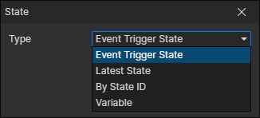

# State Getter

### Parameters

- Type
  - Event Trigger State：When a state event is triggered, read this state through it
  - Latest State：Get the latest created skill, which refreshes when the "Change Actor State" command is called
  - By State ID：Get the state corresponding to the state file ID of the specified actor, enable parameters (Actor, State File)
  - Variable：Read the state from the specified variable, enable parameter (Variable)
