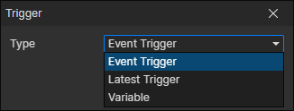

# Trigger Getter

### Parameters

- Type
  - Event Trigger：When a trigger event is triggered, read this trigger through it
  - Latest Trigger：Get the latest created trigger, which refreshes when the "Create Trigger" command is called
  - Variable：Read the trigger from the specified variable, enable parameter (Variable)
