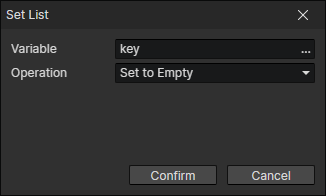

# Set List

Any type of data can be stored in the list  
Reduce repetitive operations with the "For Each" command
The list can be successfully created only if the variable is of type object or does not exist

- Variable：The target variable to be written
- Operation
  - Set to Empty：initialize a list with no values
  - Set Number List：initialize a list with numbers
  - Set String List：initialize a list with strings
  - Set Boolean：Set the list item at the specified index to a boolean
  - Set Number：Set the list item at the specified index to a number
  - Set String：Set the list item at the specified index to a string
  - Set Variable：Set the list item at the specified index to the value read from a variable
  - Split String：Split a string by the specified delimiter to generate a list
  - Add Item：Add the value read from the variable to the end of the list
  - Remove Item：Remove the value read from the variable from the list
  - Get Attribute Names：Get all the names in the attribute group and generate a list
  - Get Attribute Keys：Get all the keys in the attribute group and generate a list
  - Get Enum Names：Get all the names in the enumeration group and generate a list
  - Get Enum Values：Get all the values ​​in the enumeration group and generate a list
  - Get Actor Targets：Get all target actors in the actor target pool and generate a list