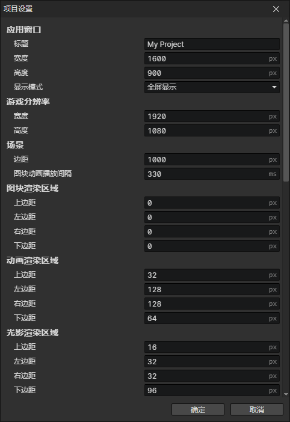
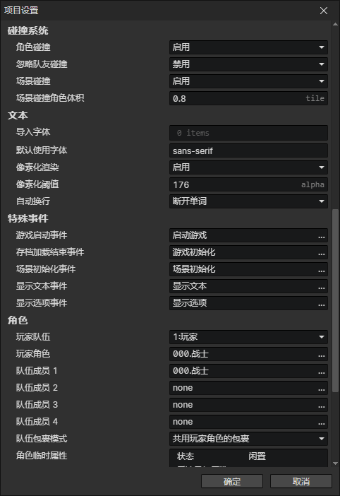
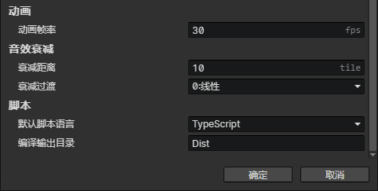

# 窗口 - 项目设置

### 应用窗口

- 标题：游戏窗口的标题
- 宽度：游戏窗口的宽度，窗口最大化和全屏模式不受影响
- 高度：游戏窗口的高度，窗口最大化和全屏模式不受影响
- 显示模式：窗口模式、窗口最大化、全屏显示

### 游戏分辨率

- 宽度：游戏画布的实际宽度，受到窗口大小影响会自动缩放画布
- 高度：游戏画布的实际高度，受到窗口大小影响会自动缩放画布

### 场景

- 边距：所有场景的网格之外的最大可见距离。边距 = 0表示摄像机锁定到有效区域中，不显示场景外的区域。(场景尺寸太小例外，有效区域会居中显示)
- 图块动画播放间隔：自动图块每个动画帧的持续时间

### 图块渲染区域

- 上边距：向上扩张图块渲染区域
- 左边距：向左扩张图块渲染区域
- 右边距：向右扩张图块渲染区域
- 下边距：向下扩张图块渲染区域

:::tip

当四个边距设置为0时，出于优化的考虑，图块渲染范围是整个屏幕内部的可见区域  
当你使用了超过场景网格大小的图块时，它所在的网格有可能在屏幕外，因此不被渲染  
比如把一棵4x3大小的树作为一个图块，而它的图块位置刚好在下方的屏幕外  
扩张图块渲染区域范围，可以显示屏幕外的大图块  
一般来说：下边距 > 左边距 = 右边距 > 上边距，渲染区域越小性能越好

:::

### 动画渲染区域

- 上边距：向上扩张动画渲染区域
- 左边距：向左扩张动画渲染区域
- 右边距：向右扩张动画渲染区域
- 下边距：向下扩张动画渲染区域

:::tip

当四个边距设置为0时，锚点在屏幕内部的动画都会被渲染  
扩张动画渲染区域范围，可以显示屏幕外的动画  
根据动画的大小调整到合适的渲染范围

:::

### 光影渲染区域

- 上边距：向上扩张光影渲染区域
- 左边距：向左扩张光影渲染区域
- 右边距：向右扩张光影渲染区域
- 下边距：向下扩张光影渲染区域

:::tip

当四个边距设置为0时，会把光源和环境光渲染到屏幕内部的可见区域  
如果一个从锚点采样光线的角色站在屏幕下方，他只有上半身可见，无法从脚底位置采样光线  
扩张光影渲染区域范围，可以从屏幕外面采样光线，进行色彩合成

:::

### 碰撞系统

- 角色碰撞：启用时，根据角色碰撞体积自动分离场景角色
- 忽略队友碰撞：启用时，相同队伍的角色之间不会发生角色碰撞
- 场景碰撞：启用时，角色无法进入其他通行区域。比如，在地面上移动的角色，无法进入水面和墙块中
- 场景碰撞角色体积：与场景碰撞时，角色可视作一个圆球，圆的直径大小作为碰撞体积，单位是场景网格大小

### 文本

- 导入字体：可导入外部字体，文件名(不含扩展名)就是字体名称
- 默认使用字体：文本、文本框、对话框等UI元素默认使用的字体
- 像素化渲染：启用时，游戏中的所有文字将被渲染成像素文字，同时启用参数(像素化阈值)
- 像素化阈值：丢弃文字边缘不透明度小于阈值(1~255)的像素，剩下的所有像素变得完全不透明
- 自动换行
  - 断开单词：适用于中文、日语、韩语，自动换行时强制断开
  - 保持完整的单词：适用于英语等，自动换行时保持完整的单词，提前换行

### 特殊事件

- 游戏启动事件：运行游戏时第一个自动执行的事件
- 存档加载结束事件：存档加载结束时自动调用的事件，可用来恢复UI
- 场景初始化事件：场景加载完毕时自动调用的事件
- 显示文本事件：显示文本指令自动调用的事件，可用来自定义对话框
- 显示选项事件：显示选项指令自动调用的事件，可用来自定义选项界面

### 角色

- 玩家队伍：初始`<玩家角色>`和`<队伍成员>`的阵营
- 玩家角色：游戏初始化自动创建的全局角色，并把他设置为玩家角色
- 队伍成员1：游戏初始化自动创建的全局角色，设置为玩家团队中的第一个成员
- 队伍成员2：游戏初始化自动创建的全局角色，设置为玩家团队中的第二个成员
- 队伍成员3：游戏初始化自动创建的全局角色，设置为玩家团队中的第三个成员
- 队伍成员4：游戏初始化自动创建的全局角色，设置为玩家团队中的第四个成员
- 队伍包裹模式
  - 共用玩家角色的包裹：玩家队伍成员使用`<初始玩家角色>`的包裹，当离开队伍时恢复成各自独立的角色包裹
  - 使用独立的包裹：玩家队伍成员使用自己的角色包裹
- 角色临时属性：所有角色初始化时自动添加预设的临时属性，这些属性无法被保存，读取存档后重置

:::tip

`<玩家角色>`不会自动加入到队伍中，可以给`<玩家角色>`和`<队伍成员>`设置同一个角色  
如果想取消队伍成员，可通过Ctrl+点击角色文件或点击空白处，取消选择文件

全局角色是什么？  
全局角色的特点是：它可以被永久保存，通过`<删除角色>`事件指令删除全局角色后，它不会真正地消失，而是会被放到后台，等待下一次出场。而普通角色，在被删除或者场景销毁时，就会永远消失。

:::

### 动画

- 动画帧率：每秒钟播放的动画时间轴帧数，而实际渲染的帧数跟FPS有关

### 音效衰减

- 衰减距离：播放`<衰减音效>`时，当摄像机中心与音效位置一样时，音量为1，当摄像机中心距离音效源距离≥衰减距离(单位：网格)时，音量为0

### 脚本

- 默认脚本语言
  - JavaScript：新建脚本文件以.js为扩展名
  - TypeScript：新建脚本文件以.ts为扩展名，启用参数(编译输出目录)
- 编译输出目录：运行游戏时，将在指定目录下加载ts编译的js文件，但是编辑器不会自动编译ts。假设存在Assets/dir/script.ts，编译输出目录是Dist，将会尝试加载Dist/dir/script.js