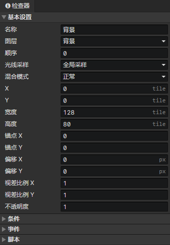

# 场景 - 瓦片地图

### 基本设置

- 名称：场景瓦片地图的名称，没有实际用处
- 图层
  - 背景层：启用参数(光线采样：环境光)
  - 前景层：启用参数(光线采样：环境光)
  - 对象层：启用参数(光线采样：锚点采样)
- 顺序：同一个图层的视差图和瓦片地图一起按顺序进行排序，当顺序相等时，按在场景对象列表中出现的顺序进行排序
- 光线采样
  - 原始图像：不受光照影响
  - 全局采样：从图像所在的多个像素点位置采样光照合成最终颜色
  - 锚点采样：从图像所在的锚点位置采样光照合成最终颜色
  - 环境光：使用当前场景的环境光合成最终颜色
- 混合模式：正常、加法、减法
- X：瓦片地图在场景网格中的初始水平位置
- Y：瓦片地图在场景网格中的初始垂直位置
- 宽度：瓦片地图水平方向上的图块数量
- 高度：瓦片地图垂直方向上的图块数量
- 锚点X：瓦片地图跟场景的连接点的水平位置(0 ~ 1)
- 锚点Y：瓦片地图跟场景的连接点的垂直位置(0 ~ 1)
- 偏移X：瓦片地图的水平偏移距离(单位：像素)
- 偏移Y：瓦片地图的垂直偏移距离(单位：像素)
- 视差比例X：当场景摄像机移动时，瓦片地图移动的水平距离的系数
- 视差比例Y：当场景摄像机移动时，瓦片地图移动的垂直距离的系数
- 不透明度：可以调节瓦片地图在场景中的可见度

### 条件列表

在加载场景阶段，当达成条件时才会创建这个瓦片地图，场景预设瓦片地图可以设置一个永久保存的独立变量

### 瓦片地图事件列表

- 自动执行：瓦片地图出现在场景时自动执行，包括读取存档后
- 自定义事件：可通过`<调用事件>`指令调用自定义事件

### 瓦片地图脚本列表

添加Javascript文件来扩展瓦片地图