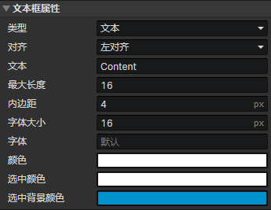

# 界面 - 文本框

### 文本框属性

可通过`<设置文本框>`事件指令修改文本框属性

- 类型
  - 文本：启用参数(文本，最大长度)
  - 数值：启用参数(数值，最小值，最大值，小数位数)
- 对齐：左对齐、居中、右对齐
- 文本：元素的文本内容，通过`<设置字符串>`事件指令读取
- 最大长度：文本字符的最大数量
- 数值：元素的数值内容，通过`<设置数值>`事件指令读取
- 最小值：允许的数值最小值
- 最大值：允许的数值最大值
- 小数位数：允许保留的最大小数位数
- 内边距：文本框的左右边距，影响输入区域的宽度
- 字体大小：文本的字体大小
- 字体：输入字体名称，如果有多个字体，用逗号隔开，按从左到右的优先顺序排列
- 颜色：文本的颜色
- 选中颜色：当文本被选中时，其中选中一部分的文本颜色
- 选中背景颜色：当文本被选中时，选中区域的颜色
