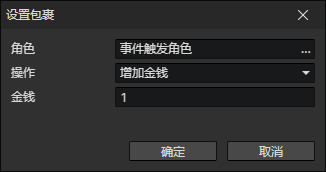

# 设置包裹

- 角色：角色访问器
- 操作
  - 增加金钱
  - 减少金钱
  - 增加物品：增加指定ID的物品
  - 减少物品：减少指定ID的物品
  - 获得装备：创建指定ID的装备，添加到角色包裹中
  - 失去装备：移除指定ID的装备
  - 获得装备实例：读取装备访问器，添加到包裹中
  - 失去装备实例：读取装备访问器，从包裹中移除它
  - 交换物品位置：交换包裹中两个物品的位置
  - 简单排序：消除物品之间的空格子，但是不改变物品顺序
  - 按文件名排序：消除物品之间的空格子，同时改变物品顺序
  - 使用全局角色的包裹：使用指定全局角色的包裹作为本角色的包裹（共享）
  - 恢复包裹：恢复自己的独立包裹
  - 重置：清空包裹中的物品和金钱